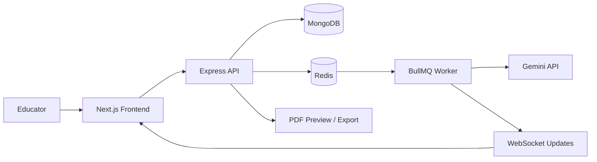

# VedaAI – AI Assessment Generation Platform

VedaAI is an AI assessment generation platform that helps educators configure exam patterns, generate question papers, review content, and export PDF-ready assessments.

**Tech Stack:** Next.js, Express.js, TypeScript, MongoDB, Redis, BullMQ, WebSockets, Gemini API

## Overview

VedaAI is a full-stack assessment workflow platform designed for fast authoring and reliable generation. It combines a modern Next.js frontend with an Express + TypeScript backend, persistent assignment storage, asynchronous question generation, and real-time progress updates for long-running AI jobs.

## Resume-Ready Highlights

- Architected a full-stack assessment generation platform enabling educators to configure exam patterns, generate AI-powered question papers, review content, and export PDF-ready assessments using Next.js, Express.js, and MongoDB.
- Designed an asynchronous question-generation pipeline using Redis and BullMQ, offloading long-running LLM requests to background workers with retry support and improved system responsiveness.
- Implemented real-time job progress tracking using WebSockets, RESTful CRUD APIs for assignment management, and a modular backend architecture supporting scalable deployment through service separation and extensible AI provider integration.

## Product Preview


## Architecture Diagram


## Key Capabilities

- Assignment creation and persistence with MongoDB
- Configurable question generation by subject, class, marks, difficulty, and format
- Synchronous and asynchronous generation flows for different workload sizes
- Redis-backed BullMQ queue for background processing and retries
- WebSocket-powered progress updates for active jobs
- Question paper preview and PDF export workflow
- Context-aware prompt building for more relevant AI output

## Architecture



The platform is intentionally split so short jobs can return quickly through the API, while heavier generation requests move to the queue and report status back to the UI in real time.

## Tech Stack

### Frontend

- Next.js 16 App Router
- React 19
- Tailwind CSS
- Zustand for state management
- Axios for API calls
- Framer Motion for UI motion
- better-react-mathjax for mathematical content rendering

### Backend

- Express 5 with TypeScript
- MongoDB with Mongoose
- Redis for job state and queue support
- BullMQ for background workers and retries
- WebSockets for progress streaming
- Gemini API integration for question generation

## Repository Structure

```text
vedaAI/
├── backend/
│   └── src/
│       ├── config/
│       ├── infra/
│       ├── jobs/
│       ├── services/
│       ├── types/
│       ├── websocket/
│       └── server.ts
├── frontend/
│   ├── app/
│   ├── components/
│   ├── lib/
│   ├── public/
│   └── src/
└── README.md
```

## Local Setup

### Prerequisites

- Node.js 18 or newer
- npm
- MongoDB connection string
- Redis connection string
- Gemini API key

### Install Dependencies

```bash
cd backend
npm install

cd ../frontend
npm install
```

### Configure Environment

Create a backend `.env` file with the following values:

```env
PORT=5000
CORS_ORIGIN=http://localhost:3000

MONGODB_URI=your_mongodb_uri
MONGODB_FALLBACK_URI=
ALLOW_START_WITHOUT_DB=false

REDIS_URL=your_redis_url

GEMINI_API_KEY=your_gemini_api_key
GEMINI_MODEL=gemini-2.0-flash
```

### Run the Backend

```bash
cd backend
npm run dev
```

Backend URL: `http://localhost:5000`

### Run the Frontend

```bash
cd frontend
npm run dev
```

Frontend URL: `http://localhost:3000`

## Core API Surface

### Assignments

- `GET /api/assignments`
- `POST /api/assignments`
- `PATCH /api/assignments/:id`
- `DELETE /api/assignments/:id`

### Question Generation

- `POST /api/questions/generate`
- `POST /api/questions/generate-async`
- `GET /api/questions/jobs/:jobId`

### Realtime

- WebSocket endpoint: `/ws`

## Deployment Notes

- Use managed MongoDB and Redis in production.
- Keep `ALLOW_START_WITHOUT_DB=false` for production reliability.
- Configure `CORS_ORIGIN` to match the deployed frontend URL.
- Keep Redis eviction policy compatible with BullMQ reliability expectations.

## Why This Project Stands Out

- It solves a real workflow problem for educators instead of acting as a demo.
- It separates fast and slow paths so the UI stays responsive under load.
- It combines persistence, background processing, and live updates in one cohesive system.
- It is structured for incremental feature growth, including new AI providers and richer assessment formats.

## License

Private project for assessment workflow implementation.
